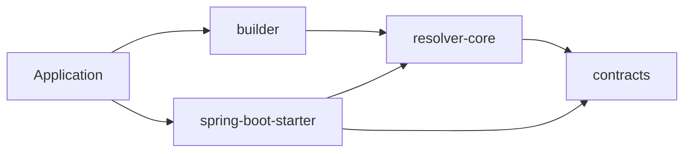

# policy-config

[](https://github.com/jho951/policy-config/actions/workflows/ci.yml)
[](https://github.com/jho951/policy-config/actions/workflows/publish.yml)
[](https://central.sonatype.com/search?q=io.github.jho951)
[](./License)
[](https://github.com/jho951/policy-config/tags)

`policy-config`는 1계층에서 **정책 엔진**이 아니라 **정책 값 조회/해석 OSS**입니다.
환경변수, System Properties, `.properties`, `Map` 등 여러 소스에 흩어진 값을 `PolicyKey<T>` 기준으로 타입 안전하게 읽고,
기본값, 별칭, 검증, 변환, 출처 정보를 포함해 해석합니다.

상세 문서: [docs/layer1-oss.md](docs/layer1-oss.md)

### 요약

```gradle
repositories {
    mavenCentral()
}

dependencies {
    implementation("io.github.jho951:policy-config-builder:1.0.1")
    implementation("io.github.jho951:policy-config-spring-boot-starter:1.0.1")
}
```

```java
import com.policyconfig.contracts.PolicyKey;
import com.policyconfig.contracts.PolicyResolver;
import com.policyconfig.builder.PolicyConfigs;

PolicyKey<Boolean> featureKey = PolicyKey.<Boolean>builder("feature.x.enabled", Boolean.class)
    .defaultValue(false)
    .alias("feature_x_enabled")
    .build();

PolicyResolver resolver = PolicyConfigs.builder()
    .env()
    .systemProperties()
    .map(Map.of("feature.x.enabled", "true"))
    .build();

boolean enabled = resolver.require(featureKey);
```

```java
var resolution = resolver.inspect(featureKey);
resolution.value();
resolution.sourceName();
resolution.matchedName();
resolution.displayValue();
```



현재 릴리스 기준 버전은 `1.0.1`입니다.

### 목표

- 여러 설정 소스의 정책 값을 한 곳에서 읽는다.
- `PolicyKey<T>` 중심의 타입 안전한 해석을 제공한다.
- default, alias, validator, converter, inspect를 일관되게 처리한다.
- 스프링 없이도 재사용 가능하게 유지한다.

---

## 구조

```text
├─ contracts
├─ resolver-core
├─ builder
├─ spring-boot-starter
├─ example
└─ docs
```

---

## 문서

- 문서 진입점: [docs/layer1-oss.md](./docs/layer1-oss.md)
- 예제 문서: [example/README.md](./example/README.md)

---

## 모듈

| Module | 설명 |
| --- | --- |
| `contracts` | `PolicyKey`, `PolicyResolver`, `PolicyResolution`, `PolicyKeyRegistry` 같은 공개 계약을 제공합니다. |
| `resolver-core` | `ConfigSource`, 기본 source, `DefaultPolicyResolver`, `ReloadablePolicyResolver`를 제공합니다. |
| `builder` | `PolicyConfigs` 조립 유틸을 제공합니다. |
| `spring-boot-starter` | Spring Boot 자동 설정, actuator endpoint, converter binding을 제공합니다. |
| `example` | Spring 예제와 endpoint 사용 예시를 제공합니다. |
| `docs` | 1계층 책임과 경계 문서를 제공합니다. |

---

## 예시

### 정책 키

```java
import com.policyconfig.contracts.PolicyKey;

public final class MyPolicies {
    private MyPolicies() {}

    public static final PolicyKey<Long> FILE_MAX_SIZE =
        PolicyKey.<Long>builder("filestorage.maxSizeBytes", Long.class)
            .namespace("app")
            .description("파일 스토리지 최대 업로드 크기")
            .defaultValue(50_000_000L)
            .build();
}
```

### Resolver

```java
import com.policyconfig.builder.PolicyConfigs;
import com.policyconfig.contracts.PolicyResolver;

PolicyResolver resolver = PolicyConfigs.builder()
    .env()
    .systemProperties()
    .map(Map.of("feature.x.enabled", "true"))
    .build();
```

### 해석 결과

```java
var resolution = resolver.inspect(MyPolicies.FILE_MAX_SIZE);
resolution.value();
resolution.sourceName();
resolution.matchedName();
resolution.displayValue();
```

### Spring Boot

```java
import com.policyconfig.contracts.PolicyKey;
import com.policyconfig.contracts.PolicyResolver;
import org.springframework.stereotype.Service;

@Service
public class UploadService {
    private static final PolicyKey<Long> MAX_SIZE =
        PolicyKey.<Long>builder("policy.upload.max-size-bytes", Long.class)
            .defaultValue(50_000_000L)
            .build();

    private final PolicyResolver policyResolver;

    public UploadService(PolicyResolver policyResolver) {
        this.policyResolver = policyResolver;
    }

    public long maxSize() {
        return policyResolver.require(MAX_SIZE);
    }
}
```

### 설정

```properties
policy.config.prefix=policy.demo
policy.config.reloadable=true
```

### Endpoint

- endpoint id: `policy-config`
- `GET /actuator/policy-config`
- `POST /actuator/policy-config` 또는 `@WriteOperation`으로 refresh
- `GET /actuator/policy-config?mode=diff`로 이전 스냅샷 대비 변경분만 확인

---

## 버전

- 현재 버전은 `1.0.1`입니다.
- 기본 릴리즈 버전은 루트 `gradle.properties`의 `version`에서 관리합니다.
- 태그는 `v1.0.1` 형식을 사용합니다.
- `publish`는 태그 push에서만 동작합니다.
- `Build`는 `main` 대상 PR과 `main` 직접 push에서 동작합니다.

---

## 릴리즈

```bash
./gradlew publishToMavenCentral -Pversion=1.0.1
```

릴리즈 워크플로우는 `main` 브랜치와 태그 흐름을 기준으로 동작합니다.

---

## 라이선스

[Apache License 2.0](./License)
